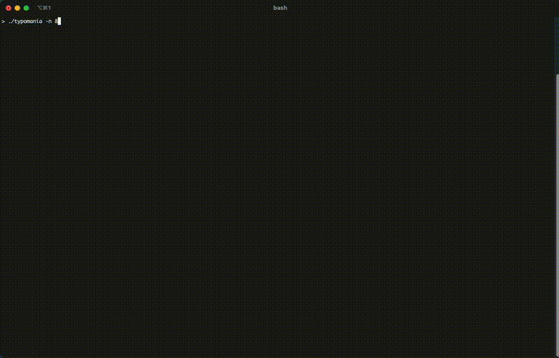

# Hobby project WPM test with a cursed twist

## To run
Build the binary `cargo build --release` then run the binary `./path/to/binary/typomania`. Use the `--help` flag to get CLI command descriptions.

## Requirements
Currently assumes that the file `/usr/share/dict/words` exists (exists in macOS by default) with the lexicon to draw words from. This can easily be updated to support other files with row-separated words.
